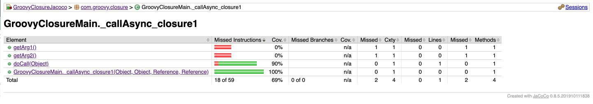

# groovy-closure-jacoco
Groovy Closure coverage issue using Jacoco 

Using Gradle6 Project, I am running Groovy project with Spock Test framework. 

Versions: 
--- |
Gradle 6+
Groovy 2.5.9
Spock 1.3

Build :  `gradle clean test jacocoTestReport`

Verify the Jacoco Test Report in build folder.

### Issue

As per design, Groovy will convert closures to Closure classes and corresponding methods will be generated in that Closure class.

Jacoco is trying to read those getter methods in Coverage and reporting less coverage no#.

`getArg1()` and `getArg2()`  are generated methods and there is no way to cover those methods as part of testing. 

